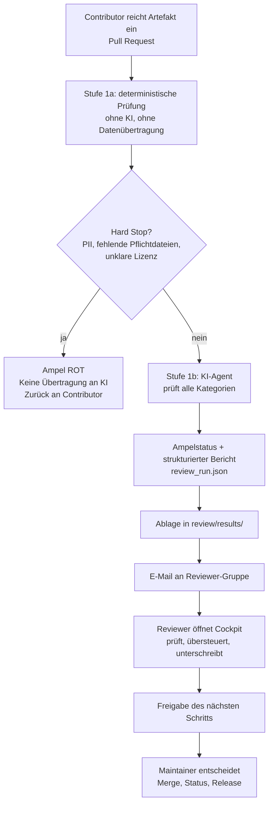

# KItomat Review-Agent: Konzept zur Abstimmung

**Stand:** 1. August 2026
**Branch:** `review/pre-review-wizard`
**Verantwortlich:** Review-Team (Ibrahim Günes)
**Adressat:** Projektowner KItomat
**Status:** Vorschlag zur Freigabe — noch keine Implementierung

---

## 1. Kurzfassung

Der Review-Bereich wird als **automatischer Prüf-Agent mit menschlicher Endentscheidung** umgesetzt.

Der Agent startet ohne manuelles Zutun, prüft ein eingereichtes Artefakt vollständig gegen die bereits im Repository festgelegte Review-Policy und vergibt einen **Ampelstatus**. Anschließend wird die Reviewer-Gruppe per E-Mail benachrichtigt. Ein menschlicher Reviewer sieht das Ergebnis, korrigiert bei Bedarf und gibt den nächsten Schritt frei.

Der entscheidende Punkt: **Der Agent bewertet, der Mensch entscheidet.** Diese Trennung ist nicht neu erfunden, sondern steht bereits wörtlich in `agents/openclaw-precheck/openclaw-agent.yml` im Hauptrepository. Das vorliegende Konzept setzt diese Spezifikation operativ um, statt eine eigene daneben zu stellen.

Alle Arbeiten bleiben in der Branch `review/pre-review-wizard`. `main`, `prompts/`, `datasets/` und `models/` werden nicht verändert.

---

## 2. Auftrag

Aus dem Feedback zur Version vom 7. Juli 2026 ergaben sich zwei Anforderungen:

1. **Ein KI-Agent führt die komplette Review-Prüfung durch und vergibt einen Ampelstatus.** Der menschliche Reviewer nimmt die letzte Anpassung vor und gibt den nächsten Schritt frei.
2. **Der Agent startet über einen Trigger.** Sobald ein Artefakt den Status „review required" erhält, geht eine Mail an die Reviewer-Gruppe und der Agent läuft an. Er holt das Paket, durchläuft den Review und meldet zurück.

Betroffen sind die drei Artefakttypen des Projekts: Prompt-Pakete, Datensatz-/Quellenpakete und KMU-/Branchenmodelle.

---

## 3. Ist-Stand (geprüft am 1. August 2026)

### 3.1 Hauptrepository `main`

| Bereich | Stand |
|---|---|
| Workflow | `.github/workflows/validate-artifacts.yml`, ausgelöst bei jedem Pull Request und Push auf `main` |
| Validatoren | `validate_metadata.py`, `validate_completeness.py`, `pii_heuristic.py` (zusammen 344 Zeilen, Python 3.11) |
| Agent-Spezifikation | `agents/openclaw-precheck/` — Policy, Systemprompt, Feedback-Template, Handoff-Flow |
| Schema | `schemas/metadata.schema.json` mit 15 Pflichtfeldern |
| Inhalte | `prompts/`, `datasets/`, `models/` — bereits mehrere reale Beiträge vorhanden |

### 3.2 Branch `review/pre-review-wizard`

Fünf Commits vom 8. Juli 2026, ausschließlich Ordnergerüst:

```text
review/wizard/     Review Wizard und lokale UI-Dateien
review/intake/     durch Maintainer vorgeprüfte Review-Kandidaten
review/results/    Ergebnisse aus dem Review
review/schemas/    Strukturdefinitionen für Review-Protokolle
review/docs/       Ablauf- und Prozessdokumentation
```

Alle Ordner sind bislang leer.

### 3.3 Zwei relevante Befunde

**Die PII-Prüfung blockiert derzeit nicht.** `pii_heuristic.py` erkennt E-Mail-Adressen, Telefonnummern, IBAN-ähnliche Zeichenketten und elfstellige Zahlen, gibt Treffer aber nur als Warnung aus und beendet sich mit Exit-Code 0. Der Pull Request läuft trotz Treffer durch. Für einen Agenten, der automatisch startet, ist das der wichtigste offene Punkt (siehe Abschnitt 9).

**Die Validatoren prüfen immer das gesamte Repository.** Sie durchsuchen `prompts/`, `datasets/` und `models/` vollständig. Bei einem Pull Request erscheinen daher auch Befunde aus fremden, längst gemergten Beiträgen. Für eine artefaktbezogene Ampel muss die Prüfung auf den tatsächlich eingereichten Beitrag eingegrenzt werden.

---

## 4. Zielarchitektur



### Warum der automatische Start vertretbar ist

Die ursprüngliche Fassung des Review-Konzepts sah vor, dass ein Mensch den KI-Lauf per Label freigibt, bevor Daten das Projekt verlassen. Die neue Anforderung verlangt einen automatischen Start. Beides gleichzeitig ist nicht möglich.

Der Vorschlag löst das so: **Nicht ein Mensch ist das Gate, sondern Stufe 1a.** Die deterministische Prüfung läuft vollständig lokal in GitHub Actions, ohne dass ein einziges Byte an einen externen Dienst geht. Erst wenn sie sauber durchläuft, startet die KI-Prüfung — automatisch.

Damit ist die Schutzwirkung erhalten: Ein Beitrag mit personenbezogenen Daten, unklarer Lizenz oder rotem Datenrisiko wird niemals automatisch übertragen. Er wird gestoppt und einem Menschen vorgelegt.

Diese Konstruktion ist durch die bestehende Policy gedeckt. `openclaw-agent.yml` definiert bereits neun `hard_stops` — genau für diesen Zweck.

---

## 5. Das Ampelmodell

Die Ampel wird nicht neu erfunden. Sie ist die Darstellung der fünf Status, die `openclaw-agent.yml` bereits kennt.

| Ampel | Status aus der Policy | Bedeutung | Nächster Schritt |
|:---:|---|---|---|
| 🔴 **rot** | `hard_stop`, `needs_fixes` | Blockierender Befund: Pflichtdateien fehlen, PII-Verdacht, Metadaten unvollständig | Zurück an Contributor |
| 🟡 **gelb** | `needs_sources`, `needs_trust_review` | Nachbesserung nötig oder Trust-Review erforderlich (`data_risk` gelb/rot, sensible Domäne) | Contributor-Nacharbeit oder Maintainer-Trust-Review |
| 🟢 **grün** | `ready_for_human_eval` | Keine blockierenden Befunde, strukturell prüfbar | Reviewer kann freigeben |

`post_mvp_recommended` ist kein Ampelwert, sondern ein zusätzliches Kennzeichen. Es beschreibt Beiträge, die zu komplex oder zu risikobehaftet sind, um das aktuelle Release zu blockieren, und in den Backlog gehören.

### Grün heißt nicht freigegeben

Diese Abgrenzung steht bereits in `agents/openclaw-precheck/handoff-flow.md` und wird unverändert übernommen:

> `ready_for_human_eval` bedeutet, dass der Beitrag strukturell prüfbar erscheint. Es bedeutet **nicht**: freigegeben, gemergt, veröffentlicht, rechtlich geprüft, fachlich auditiert oder final `bronze`.

Grün ist eine Empfehlung an den Reviewer, keine Entscheidung. Der Reviewer kann jede Ampelfarbe übersteuern — und muss diese Übersteuerung begründen. Die Begründung wandert in das Review-Protokoll.

### Namensabgrenzung

`metadata.yml` enthält bereits ein Feld `data_risk` mit den Werten `green`, `yellow` und `red`. Um Verwechslungen auszuschließen, heißt das neue Feld **`review_signal`**, nicht `ampel` oder `status`.

Beide Werte stehen nebeneinander im Bericht und bedeuten Unterschiedliches: `data_risk` beschreibt eine Eigenschaft des Artefakts, `review_signal` das Ergebnis der Prüfung.

---

## 6. Trigger und Benachrichtigung

### 6.1 Klärungsbedarf: Was ist „review required"?

Der Begriff ist auf GitHub mehrdeutig. Es gibt zwei verschiedene Dinge:

**Der native Branch-Protection-Status „Review required".** Er erscheint automatisch an jedem Pull Request, für den ein Approval aussteht. Er lässt sich technisch **nicht** als Auslöser für einen Workflow verwenden und ist nicht steuerbar.

**Ein Label, zum Beispiel `review-required`.** Es wird bewusst gesetzt, kann von einem Workflow ausgewertet werden und erzeugt einen sauberen, nachvollziehbaren Auslösepunkt.

**Vorschlag:** Wir verwenden ein Label. Der Maintainer setzt `review-required`, sobald ein Beitrag zur Prüfung freigegeben ist. Das entspricht auch dem bereits vorgesehenen Schritt „Maintainer macht eine erste Vorprüfung" aus `review/README.md`.

Diese Frage bitten wir den Owner zu bestätigen, da sie die Umsetzung bestimmt.

### 6.2 Ablauf des Triggers

```text
Maintainer setzt Label review-required
  -> Workflow startet
  -> Stufe 1a läuft (lokal, deterministisch)
  -> bei Hard Stop: Abbruch, Ampel rot, Mail mit Begründung
  -> sonst: KI-Agent läuft
  -> Ergebnis nach review/results/
  -> Mail an Reviewer-Gruppe mit Ampel, Kurzfassung und Link
```

### 6.3 E-Mail

Die Benachrichtigung geht an einen Verteiler, nicht an Einzelpersonen. Die Adresse liegt als Repository-Secret, nicht im Code. Als Versanddienst eignet sich ein EU-gehosteter Anbieter mit kostenlosem Kontingent.

Inhalt der Mail bewusst knapp: Artefaktname, Typ, Ampelfarbe, Anzahl der Befunde nach Schweregrad, Link zum Pull Request und zum Ergebnisordner. **Keine Befundtexte in der Mail** — Mail ist kein geeigneter Ablageort für Bewertungen.

### 6.4 Technische Einschränkung bei Fork-Beiträgen

Laut `README.md` können Beiträge auch per Fork eingereicht werden. Bei Pull Requests aus einem Fork stellt GitHub aus Sicherheitsgründen **keine Repository-Secrets bereit**. Ein Agent, der einen API-Schlüssel benötigt, würde in genau diesen Fällen nicht starten.

Das ist lösbar, muss aber von Beginn an eingeplant werden. Der übliche Weg ist ein Zwei-Workflow-Muster: Ein Workflow ohne Rechte sammelt die geänderten Dateien und legt sie als Artefakt ab; ein zweiter, privilegierter Workflow verarbeitet dieses Artefakt anschließend. Dateien aus dem Fork werden dabei ausschließlich als **Daten gelesen**, niemals als Code ausgeführt.

Wird dieser Punkt übersehen, funktioniert der Agent nur bei Beiträgen aus dem Hauptrepository — also gerade nicht bei externen Contributoren.

---

## 7. Die Rolle des Reviewers

Mit einem Agenten, der die Prüfung übernimmt, ändert sich die Aufgabe des Review Wizard grundlegend.

**Bisher (Wizard v1):** Ein Prüfwerkzeug. Der Reviewer lud Dateien, ließ eine Formalprüfung laufen und arbeitete sieben Kategorien manuell durch.

**Künftig:** Ein **Reviewer-Cockpit**. Es lädt das vom Agenten erzeugte `review_run.json`, zeigt Ampel und Befunde, und der Reviewer prüft, übersteuert einzelne Kategorien, ergänzt Kommentare und unterschreibt.

Das ist deutlich weniger Code als die bisherige Fassung und eine spürbare Vereinfachung.

### Was der Reviewer tut

1. Ampel und Kurzfassung sichten
2. Befunde durchgehen, die der Agent als unsicher markiert hat
3. Bei Bedarf Kategorien übersteuern — mit Begründung
4. Entscheidung treffen: Rückgabe an Contributor oder Weitergabe an Maintainer
5. Ergebnis exportieren

Der Wizard bleibt eine eigenständige HTML-Datei unter `review/wizard/`. Er verändert die zentrale Web-Oberfläche des Projekts nicht und importiert keine Komponenten daraus. Die No-Impact-Regel bleibt unangetastet.

**Technischer Hinweis:** Ein Browser kann keine Dateien in das Repository schreiben. Der Reviewer lädt die Exporte herunter und legt sie ab, oder ein Workflow übernimmt die Ablage. Das wird im README des Review-Bereichs dokumentiert.

---

## 8. Ergebnisablage

### 8.1 Struktur

```text
review/intake/<artifact-id>/
    snapshot/              geprüfter Stand des Beitrags
    manifest.json          Dateiliste mit Hashwerten, PR-Nummer, Commit-SHA

review/results/<artifact-id>/<run-id>/
    review_run.json        strukturiertes Protokoll, maschinenlesbar
    agent_report.md        Befunde des Agenten im Klartext
    contributor_feedback.md   was der Contributor ändern soll
    maintainer_handoff.md     Empfehlung an den Maintainer
```

### 8.2 Der Zweck von `review/intake/`

Der Ordner erhält eine klare Funktion: Der Agent legt dort den **Stand ab, den er tatsächlich geprüft hat** — mit Hashwerten je Datei und dem Commit-SHA.

Damit ist jeder Review reproduzierbar. Ändert der Contributor den Beitrag nach der Prüfung, ist am abweichenden Hash sofort erkennbar, dass das Review-Ergebnis veraltet ist.

### 8.3 Sichtbarkeit der Ergebnisse

Nach Abstimmung liegen **alle Ergebnisse öffentlich** in `review/results/`. Das ist die einfachste Lösung, erfordert keine zweite Infrastruktur und passt zum offenen Charakter des Projekts.

Daraus folgt eine verbindliche Formulierungsregel:

> Berichte bewerten **Artefakte, nicht Personen.** Formulierungen beziehen sich auf Dateien, Metadaten und Inhalte — nicht auf Fähigkeiten oder Sorgfalt der Beitragenden. Der Agent-Systemprompt wird entsprechend eingeschränkt, und der Wizard weist den Reviewer beim Unterschreiben darauf hin.

Das `[intern]`-Präfix aus dem früheren Wizard entfällt ersatzlos. Wenn alles öffentlich ist, gibt es keine internen Kommentare — diese Unterscheidung wäre irreführend.

### 8.4 Abholpunkt für das Gesamtprojekt

Für den Projektowner gilt als verbindlicher Abholpunkt:

```text
review/results/<artifact-id>/<run-id>/review_run.json
```

Diese Datei enthält Ampelstatus, alle Befunde, die Entscheidung des Reviewers und den Zeitstempel. Sie ist die maßgebliche Schnittstelle zwischen Review-Team und Projektleitung. Alle übrigen Dateien sind menschenlesbare Aufbereitungen desselben Inhalts.

---

## 9. Notwendige Anpassungen — ohne Eingriff in `main`

Die No-Impact-Regel verbietet Änderungen an `main`, an den bestehenden Validatoren und am zentralen Workflow. Das ist umsetzbar, erfordert aber eine bewusste Konstruktion.

### 9.1 Das PII-Gate

`pii_heuristic.py` in `main` blockiert nicht und **soll auch nicht verändert werden**. Stattdessen entsteht in der Review-Branch eine eigene Stufe-1a-Prüfung unter `review/agent/`, die:

- die Erkennungsmuster aus dem bestehenden Validator **importiert**, statt sie zu kopieren — dadurch bleiben beide automatisch synchron,
- die Prüfung auf das eine eingereichte Artefakt eingrenzt,
- und die Treffer als **blockierend** behandelt.

Die Verschärfung gilt damit nur im Review-Prozess. Der bestehende Workflow auf `main` verhält sich unverändert. Sollte das Projekt die Blockade später generell übernehmen wollen, ist das eine separate Entscheidung des Owners.

### 9.2 Artefaktbezogene Prüfung

Die Stufe-1a-Prüfung im Review-Bereich betrachtet nur den Ordner des eingereichten Beitrags. Befunde aus fremden Beiträgen erscheinen nicht mehr im Bericht.

### 9.3 Zusammenfassung der Eingriffe

| Bereich | Änderung |
|---|---|
| `main` | **keine** |
| `tools/validators/` | **keine** — werden nur importiert |
| `.github/workflows/validate-artifacts.yml` | **keine** |
| `prompts/`, `datasets/`, `models/` | **keine** |
| `agents/openclaw-precheck/` | **keine** — Policy wird gelesen, nicht verändert |
| `review/` in der Review-Branch | neue Dateien |
| Neuer Workflow für den Agenten | nur in der Review-Branch |

---

## 10. Grenzen des Agenten

Diese Grenzen gehören ausdrücklich in das Konzept, weil eine Ampel sonst mehr Sicherheit suggeriert, als tatsächlich vorhanden ist.

**Was der Agent zuverlässig kann:** Vollständigkeit der Pflichtdateien, Metadatenfelder und Wertebereiche, Vorhandensein der Szenario-Triade, Verständlichkeit und Zielgruppenschärfe, Qualität und Konsistenz der Beispiele, formale Widersprüche im Beitrag.

**Was der Agent nicht kann:** Prüfen, ob eine angegebene Quelle tatsächlich existiert und das aussagt, was der Beitrag behauptet. Fachliche Richtigkeit in einer Spezialdomäne beurteilen. Rechtliche oder Compliance-Aussagen treffen — das ist in der Policy ausdrücklich untersagt.

**Konsequenz für die Umsetzung:** Jede Kategorie im Bericht erhält ein Feld `confidence`. Die Kategorien *Quellen* und *Trust* werden bei `data_risk` gelb oder rot immer mit `human_mandatory: true` gekennzeichnet — dort ist eine menschliche Prüfung nicht optional, unabhängig von der Ampelfarbe.

---

## 11. Regelkonformität

| Festgelegte Regel | Quelle | Einhaltung im Konzept |
|---|---|---|
| KI entscheidet nicht über Freigabe | `openclaw-agent.yml`, `not_allowed` | Ampel ist Empfehlung; Reviewer unterschreibt, Maintainer entscheidet |
| Kein Merge, kein Push auf `main` durch Automatik | `openclaw-agent.yml` | Agent schreibt ausschließlich in `review/` der Review-Branch |
| Keine echten personenbezogenen Daten | `README.md`, `hard_stops` | Stufe-1a-Gate blockiert vor jeder Übertragung |
| Grün ≠ freigegeben | `handoff-flow.md` | Wortlaut unverändert übernommen, im Cockpit sichtbar |
| Keine Änderung an Web-GUI und Bibliothek | No-Impact-Regel vom 7.07.2026 | Wizard bleibt standalone; keine Datei außerhalb `review/` betroffen |
| Menschliche Review bleibt Pflicht | `README.md`, Reviewed-only-Regel | HITL-Schritt ist verpflichtend, nicht überspringbar |
| Keine Rechts- oder Auditaussagen | `review-policy.md` | Systemprompt schließt das aus; Disclaimer in jedem Bericht |

---

## 12. Entscheidungen, die wir vom Owner brauchen

1. **Auslöser bestätigen.** Label `review-required` statt des nativen GitHub-Status — technisch notwendig (Abschnitt 6.1).
2. **Automatischer KI-Start bestätigen.** Der Agent läuft nach bestandener Stufe 1a ohne weitere manuelle Freigabe an (Abschnitt 4).
3. **Abholpunkt bestätigen.** `review/results/<artifact-id>/<run-id>/review_run.json` als verbindliche Schnittstelle (Abschnitt 8.4).
4. **Verteiler benennen.** Wer gehört zur Reviewer-Gruppe, an welche Adresse geht die Benachrichtigung?
5. **Budget und Betrieb klären.** Der Agent verursacht laufende Kosten pro Prüfung. Wer stellt den Zugang bereit, wer trägt die Kosten, wo liegt das Secret?
6. **Fork-Beiträge einordnen.** Sollen Beiträge aus Forks unterstützt werden? Falls ja, ist der Mehraufwand aus Abschnitt 6.4 einzuplanen.

---

## 13. Vorgeschlagene Umsetzungsschritte

| Schritt | Inhalt | Abhängig von |
|---|---|---|
| 1 | `review_run.schema.json` — Struktur des Review-Protokolls festlegen | — |
| 2 | Stufe 1a im Review-Bereich: artefaktbezogen, mit PII-Gate | Schritt 1 |
| 3 | Agent-Kern: Prüflogik gegen `openclaw-agent.yml`, Ampelvergabe | Schritte 1–2 |
| 4 | Workflow mit Label-Trigger und Ergebnisablage | Schritt 3 |
| 5 | E-Mail-Benachrichtigung an den Verteiler | Schritt 4, Entscheidung 4 |
| 6 | Reviewer-Cockpit (Wizard v2) | Schritt 1 |
| 7 | Testlauf an einem realen Beitrag aus dem Repository | alle |

Die Schritte 1, 2 und 6 sind unabhängig von den offenen Entscheidungen und könnten sofort beginnen. Die Schritte 3 bis 5 setzen die Freigabe des Owners voraus.

---

## 14. Was dieses Konzept bewusst nicht enthält

- **Keine Festlegung auf einen KI-Anbieter.** Der Agent wird gegen die vorhandene, anbieterneutrale Spezifikation gebaut. Welcher Dienst die Prüfung tatsächlich ausführt, ist eine Konfiguration am Ende der Umsetzung und ändert den Prozess nicht.
- **Keine automatische Statusvergabe.** Der Agent setzt weder `bronze` noch einen anderen Reifegrad.
- **Keine GitHub-Automatik über den Review-Bereich hinaus.** Keine Labels im Hauptrepository, keine PR-Kommentare, keine Merges.
- **Keine Aussage zur späteren Integration in die Web-Oberfläche.** Das bleibt eine getrennte Entscheidung.

---

*Dieses Dokument beschreibt einen Vorschlag. Die Umsetzung beginnt nach Freigabe durch den Projektowner.*
